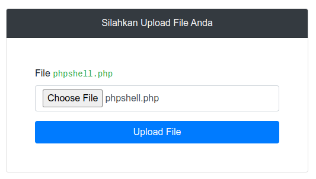
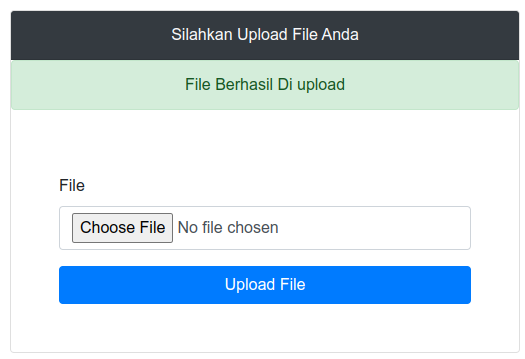
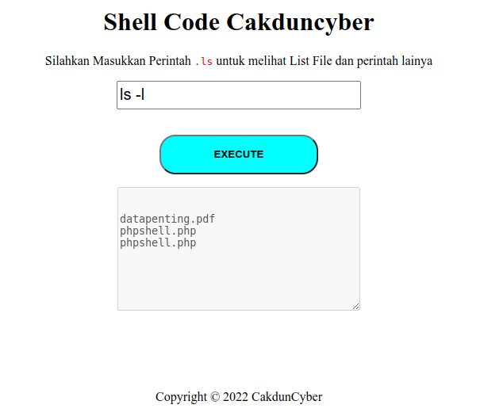

:warning: **DISCLAIMER !!!** <span> Pembuatan source code ini bertujuan untuk bahan pembelajaran, jika ada terjadi kesalahan yang mengakibatkan suatu kerugian merupakan tanggung jawab sendiri</span>:

# Shell code

<p>Php shellcode merupakan sebuah tool yang memanfaatkan file <code>.php</code> dalam menjalankan perintah command line di dalam server, dengan cara mengupload file shellcode</p>

# Instalasi

```
git clone https://github.com/cakdun/shell-code-cakdun-cyber.git

```

# Cara penggunaan

## Masuk ke dalam sebuah website yang memiliki celah filter file, dan upload



## Upload file berhasil



## Masuk ke url yang mengarah ke halaman file shellcode yang kita upload

<p>Silahkan jalankan perintah <code>cli</code> yang anda inginkan</p>


